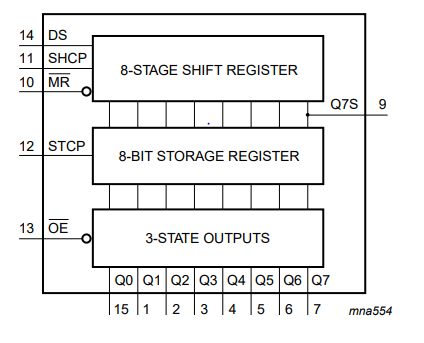
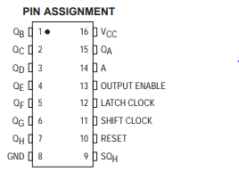
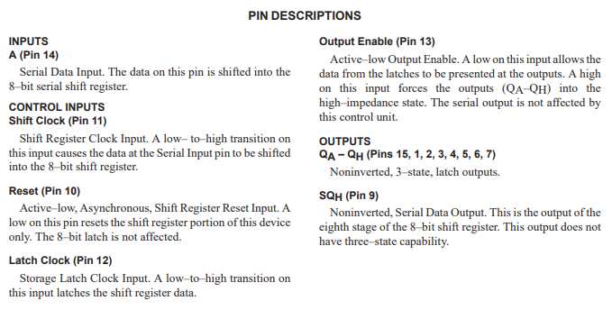

# c51-start

Notebook of learning c51 mcu

## Env Setup

1. download keil
1. I use usb to give board power so need to install CH340 driver, but it failed, seems not compatible with win10, and I use [CH341Ser](http://www.wch.cn/download/CH341SER_EXE.html) instead
1. STC-ISP software download, [Link here](http://www.stcisp.com/stcisp620_off.html)

### 回忆篇 - 一些常用元器件及其使用

1. Hello world sample - turn on led
    * this setup cost me about 2 hours...
1. Turn on/off relay
1. Bee
1. Button
    * when handle with button event, add delay to avoid shake.

#### 数码管

* 74HC595 用于扩展数码管
* pin9 级联输出
* A 数据输入位
* pin11 数据记录位，给一个高电平脉冲作为标记（0-1-0）
* pin12 数据输出位，一个高电平脉冲，引脚输出变为记录的样子

#### 矩阵键盘

过程比较长，并没有想象的简单，但是可以通过慢慢的迭代来完成这个功能，比如先点亮数码管，到数码管显示两位，再到数码管根据参数显示。。。最后再到键盘显示

#### 时钟芯片 DS1302

* C51单片机的语句运行时间是 us 级别的
* 通信规则：先发命令码，再读/写数据
* 命令码可以告诉芯片你想做什么
* 读出来的时间数值是十六进制的，比如读出来的秒位0x59 - 十进制显示为89, 需要在数码管显示的时候做下处理
* 在写之前记得关闭写保护，你不能确定之前的程序有没有关闭，不然可能不能进行写的动作

#### AT24C02 断电保护

* data change only happened when SCL is low
* 数据读取的时候有四步，我一直以为只有三步的。。。
    + 输入操作 w
    + 输入地址
    + 输入操作 r
    + 读取返回值

#### PCF8591 实现AD/DA 转化

基本和上节内容一样，也是用了IIC协议，可以重用很多函数。 呼吸灯里面的实现算法还是很巧妙的。。。

#### 串口通信

1. 寄存器设置
1. 波特率设置， 9600。 选定 11.0592M 的晶振，刚好整除
1. 当数据接受完后， RI自动变1， 处理完后软件复位 0

很多概念还是很模糊，寄存器有哪些功能什么的，不过我还是打算先看下去，以后用需要的话再回头复习

#### LCD1602 显示

Busy Check 的时候很坑的一点， 当 E 从 0 变为 1 时, BF flag 才会填充到IO口。。。

### 相关资料

74595 芯片阅读:

通过上面的功能图可以比较直观的理解74595的工作原理：

* 使用时通过 DS 引脚串行输入数据
* SHCP - shift register clock pin, 相当于一个开关，出发时数据进入
* STCP 相当于一个闸，开启后数据统一输出到 Qn pin 脚
* Q7S，相当于芯片扩容，一片只能存8位，两片的话可以扩展到16位

引脚说明图：

### 创建自己的库文件

试着用网上的教程走了一遍，都没能成功，菜菜菜。。。有机会再试试把，浪费一晚上时间了

## 采坑实录

1. 习惯了 Java 语法，习惯性的没有把变量声明放到函数体第一排，排了半天的错，擦擦擦~

## TODO

1. 搜索一下怎么给C程序定制注释，让他看上去更专业
